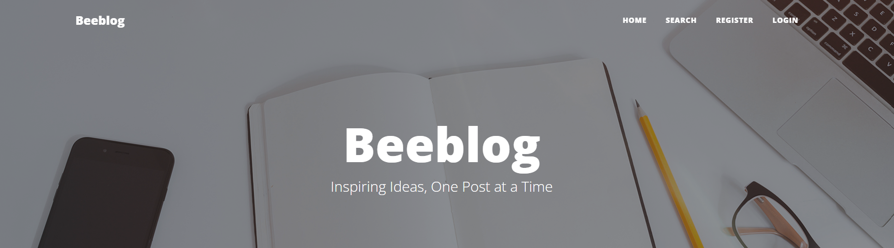

# Beeblog

<!-- Back to Top Navigation Anchor -->
<a name="readme-top"></a>

<div align="center">
  <a href="https://github.com/Adekemi02/beeblog">
    
  </a>
</div>

---

<!---Project Logo --->

<div align="center">
  <h1>
  </h1>
</div>

<div>
  <p align="center">
    <a href="https://github.com/Adekemi02/beeblog#readme"><strong>Explore the Docs »</strong></a>
    <br />
    <a href="https://github.com/Adekemi02/beeblog/blob/main/static/blog/img/Beeblog.png">View Demo</a>
    ·
    <a href="https://github.com/Aadekemi/beeblog/issues">Report Bug</a>
    ·
    <a href="https://github.com/Adekemi02/beeblog/issues">Request Feature</a>
  </p>
</div>

---

<!--- Table of Contents --->

<details>
  <summary>Table of Contents</summary>
  <ol>
    <li>
      <a href="#about-beeblog">About Beeblog</a>
      <ul>
        <li><a href="#built-with">Built With</a></li>
      </ul>
    </li>
    <li><a href="#features">Features</a></li>    
    <li><a href="#future-features">Future Features</a></li>
    <li><a href="#getting-started">Getting started</a></li>
    <li><a href="#future-plans">Future plans</a></li>
    <li><a href="#sample">Sample</a></li>
    <li><a href="#contact">Contact</a></li>
    <li><a href="#contributing">Contributing</a></li>
    <li><a href="#license">License</a></li>
  </ol>
  <p align="right"><a href="#readme-top">back to top</a></p>
</details>

---

<!--- About the blog --->
## About Beeblog
This is blog application created with Django. A feature-rich blog application built with Django. This project includes user authentication, blog management, commenting, and various other features aimed at providing a robust blogging platform.

---

<!-- ### Built With: -->
## Built with

    

---

<!-- ### Features: -->
## Features

- **User Authentication**: Register, login, and manage user accounts.
- **Blog Management**: Create, edit, and delete blog posts.
- **Commenting System**: Users can comment on blog posts; anonymous and authenticated users supported.
- **Category Filtering**: Filter blog posts by category.
- **Search Functionality**: Search for blog posts by title or content (in view).

---

<!-- ### Future Features: -->
## Future Features

1. **Profile Pages for Bloggers**: 
   - Allow users to view blogger profiles, their previous articles, and more.
2. **Analytics and Dashboards**:
   - Provide insights into blog statistics, user engagement, and post performance.
3. **Enhanced Search Filters**:
   - Allow users to select multiple categories for filtering posts.
4. **Secure Coding Practices**:
   - Implement best practices to enhance the security of the application.
5. **Containerization**:
   - Plan to use Docker for containerizing the application to streamline deployment.
6. **Bookmark Feature**:
   - Enable users to bookmark their favorite blog posts for easy access.

---

<!-- ### Usage: -->
## Getting Started

### Cloning the Repository

To get started with this project, clone the repository:

```bash
git clone https://github.com/Adekemi02/beeblog.git
cd your-repository
```

### Setting Up the Environment

1. **Create a Virtual Environment**

   ```bash
   python -m venv env
   ```

2. **Activate the Virtual Environment**

   On Windows:
   
   ```bash
   .\env\Scripts\activate
   source env/Scripts/activate
   ```

   On macOS/Linux:
   
   ```bash
   source env/bin/activate
   ```

3. **Install Dependencies**

   ```bash
   pip install -r requirements.txt
   ```

4. **Set Up Environment Variables**

   Create a `.env` file in the root directory and add the following:

   ```
   EMAIL_HOST_USER=your-email@gmail.com
   EMAIL_HOST_PASSWORD=your-email-password
   ```

   Update your `settings.py` to use these environment variables:

   ```python
   import os
   from dotenv import load_dotenv

   load_dotenv()

   EMAIL_BACKEND = 'django.core.mail.backends.smtp.EmailBackend'
   EMAIL_HOST = 'smtp.gmail.com'
   EMAIL_HOST_USER = os.getenv('EMAIL_HOST_USER')
   EMAIL_HOST_PASSWORD = os.getenv('EMAIL_HOST_PASSWORD')
   EMAIL_PORT = 587
   EMAIL_USE_TLS = True
   ```

5. **Apply Migrations**

   ```bash
   python manage.py makemigrations
   python manage.py migrate
   ```

6. **Create a Superuser**

   ```bash
   python manage.py createsuperuser
   ```
7. **To populate the category section**
   Navigate to the blog app and go to the populate_category.py inside the management folder. Update the file to your satisfaction. Then go to your terminal and run the following command:

   ```bash
   python manage.py populate_category
   ```

8. **Run the Development Server**

   ```bash
   python manage.py runserver
   ```

   You can now access the application at `http://127.0.0.1:8000/`.

---

<!-- ### Future Plans: -->
## Future Plans

### Secure Coding Practices

- **Use Environment Variables**: Store sensitive data such as passwords and API keys in environment variables.
- **Regular Updates**: Keep your dependencies and Django version up to date to mitigate security vulnerabilities.
- **Data Validation**: Ensure all user inputs are validated and sanitized.
- **Use HTTPS**: Ensure the application uses HTTPS to secure data in transit.

---

<!-- Sample Screenshot -->
## Sample

<div align="center">
  <h1>
  </h1>
</div>

---

<!-- Contact -->
## Contact

Barakat Adisa - [twitter](https://twitter.com/adisa_adekhemie) - 
[linkedin](https://linkedin.com/in/adekhemieadisa)
adisabarakatadekemi@gmail.com

Project Link: [Beeblog](https://github.com/Adekemi02/beeblog)

---

<!-- ### Contribution: -->
## Contributing

Contributions are welcome! Please submit a pull request or open an issue if you have suggestions or find bugs.

---

<!-- ### License: -->
## License

This project is licensed under the MIT License - see the [LICENSE](LICENSE) file for details.

---

